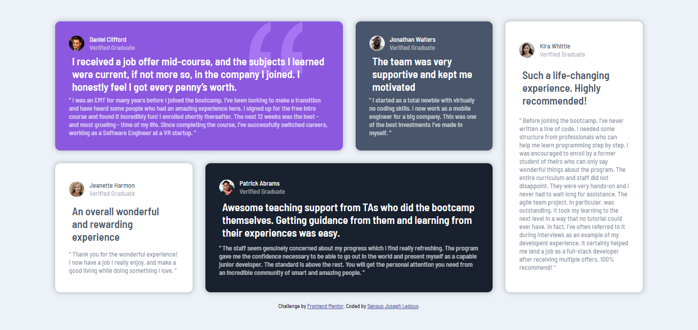

# Frontend Mentor - Testimonials grid section solution

This is a solution to the [Testimonials grid section challenge on Frontend Mentor](https://www.frontendmentor.io/challenges/testimonials-grid-section-Nnw6J7Un7). Frontend Mentor challenges help you improve your coding skills by building realistic projects. 

## Table of contents

- [Overview](#overview)
  - [The challenge](#the-challenge)
  - [Screenshot](#screenshot)
  - [Links](#links)
- [My process](#my-process)
  - [Built with](#built-with)
  - [What I learned](#what-i-learned)
  - [Continued development](#continued-development)
  - [Useful resources](#useful-resources)
- [Author](#author)

## Overview

### The challenge

Users should be able to:

- View the optimal layout for the site depending on their device's screen size

### Screenshot

### Links

- Solution URL: [https://github.com/ledoux25/TESTIMONIALS-GRID-SECTION]
- Live Site URL: [https://ledoux25.github.io/TESTIMONIALS-GRID-SECTION/](https://your-live-site-url.com)

## My process

### Built with

- Semantic HTML5 markup
- CSS custom properties
- Flexbox
- CSS Grid
- SCSS

### What I learned

I learned how to make use of css grid wich is marvelous when asociated ton flex box.

### Continued development

I have juste 2 challenges left before starting my JS course, i'm do exited

### Useful resources

- [https://fonts.google.com/specimen/Barlow+Semi+Condensed](https://www.example.com) - This helped to access the font necessary for this challenge.

## Author

- Frontend Mentor - [@ledoux25](https://www.frontendmentor.io/profile/ledoux25)
- Twitter - [@SanguoLedo15304](https://https://twitter.com/SanguoLedo15304)

